# cookiebookie
A recipe book. Created to add, edit, read, delete recipes. MERN stack. Screenshots added.

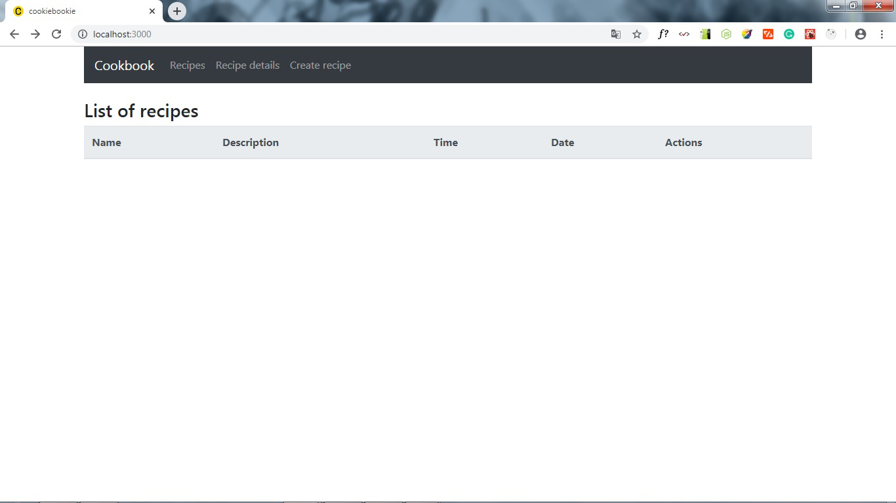
the main page of the app

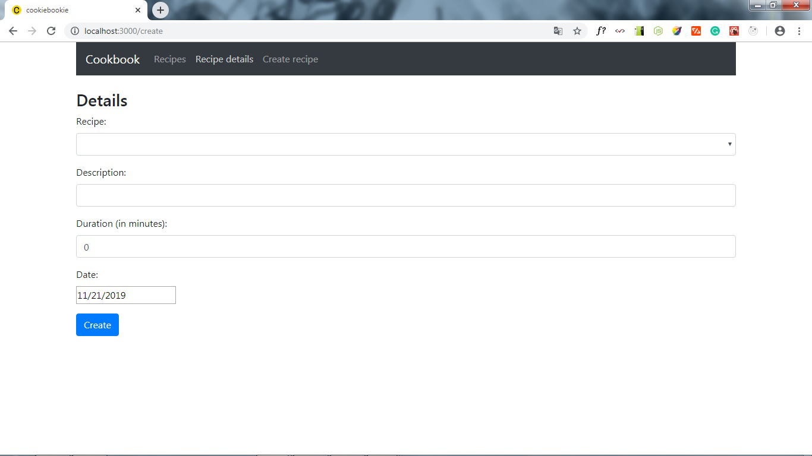
recipe details page

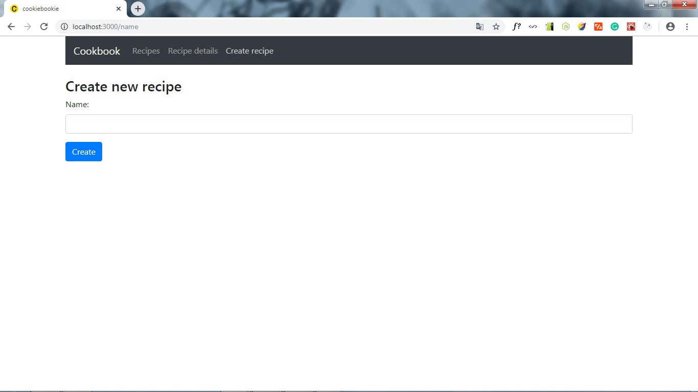
the page of creation of the recipe

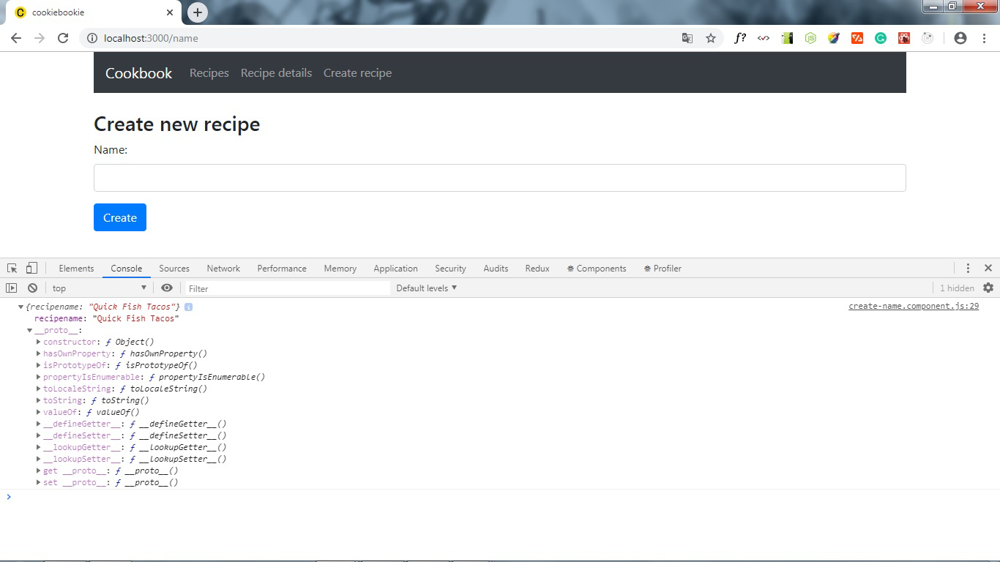
new recipe name is created in the console

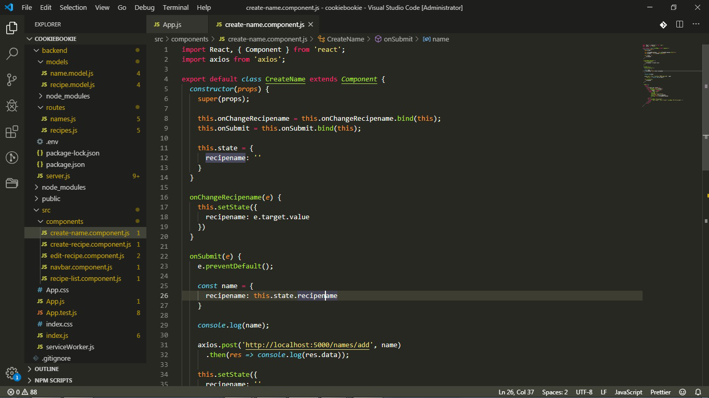
project view tree

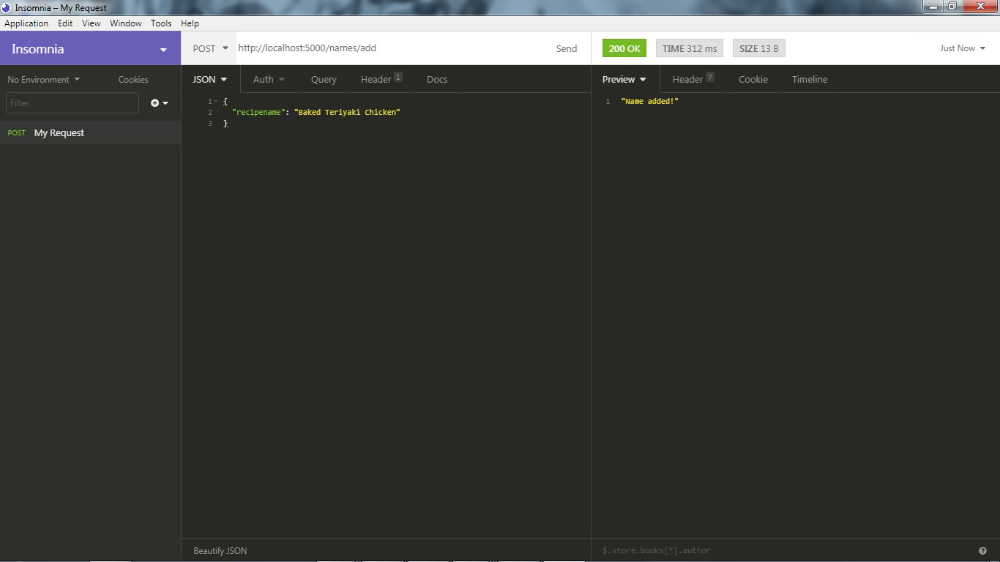
recipe successfully added by the POST method

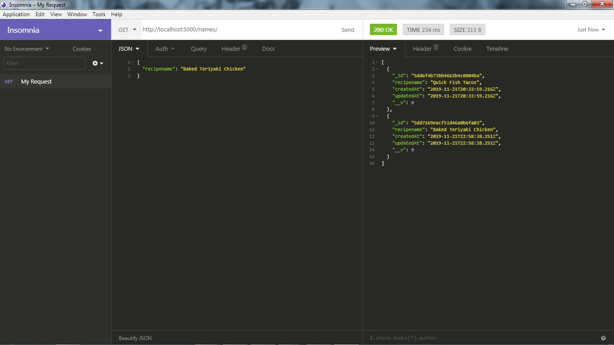
the recipes returned with the GET method

recipes in Atlas MongoDB

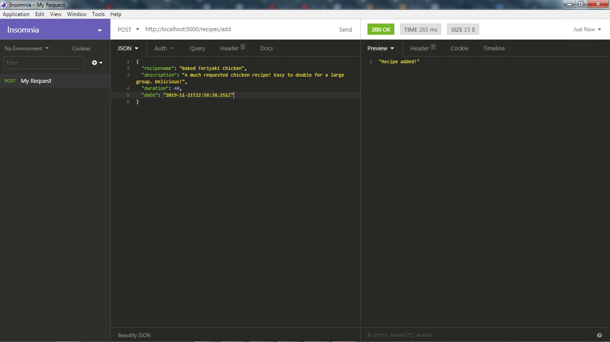
updation of the recipe

recipes preview with the GET post

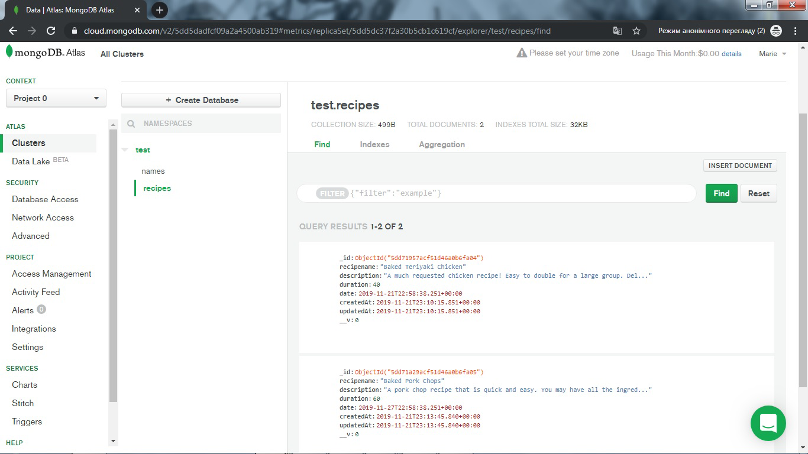
added recipes in Atlas MongoDB

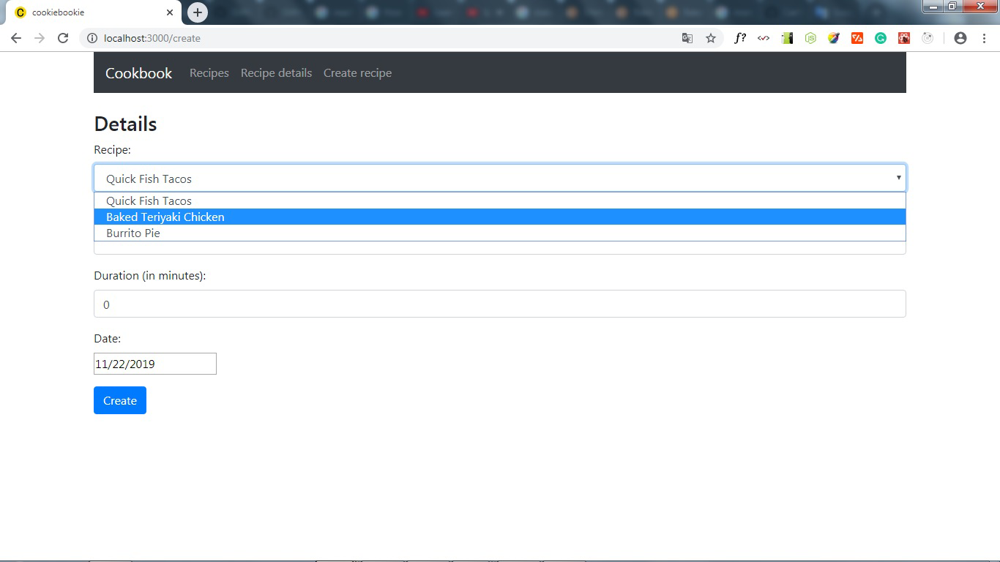
list of the recipes in recipe details menu

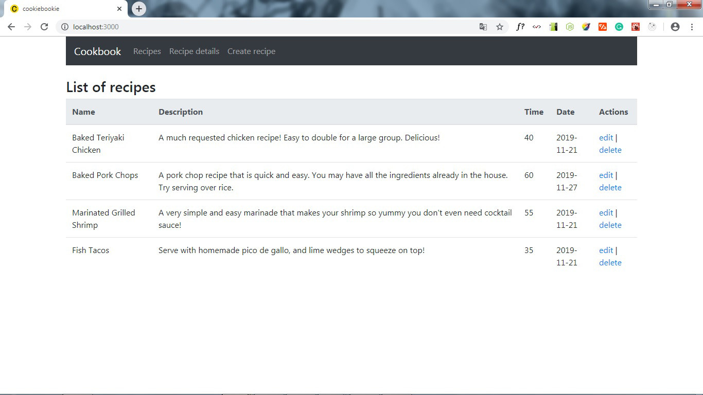
list of the recipes on the main page

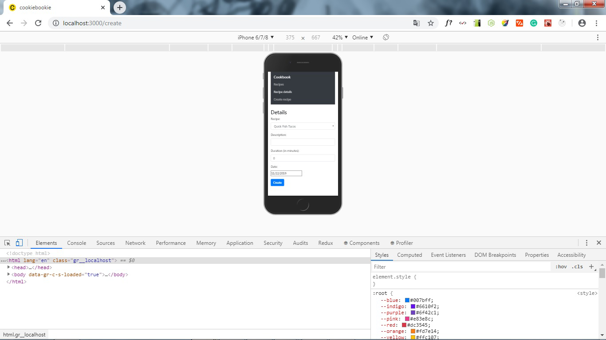
app view on the phone

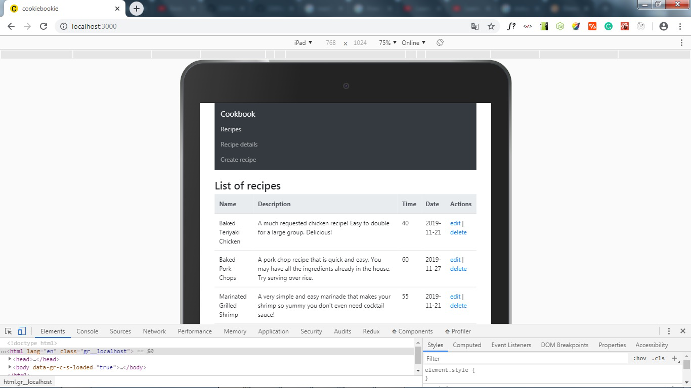
app view on the tablet
