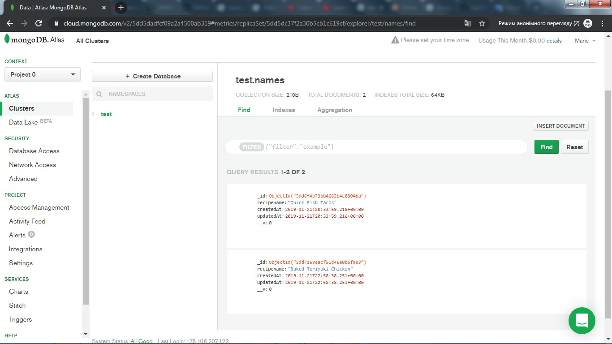
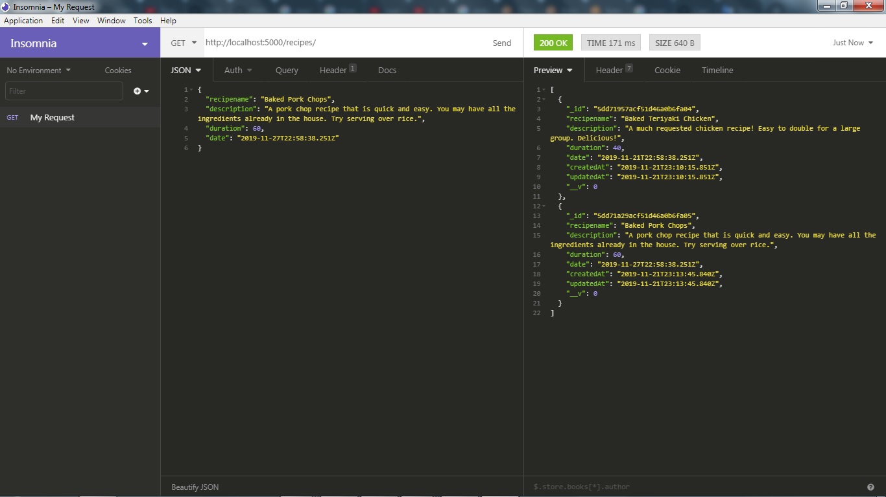

# cookiebookie
A recipe book. Created to add, edit, read, delete recipes. MERN stack. Screenshots added.

the main page of the app

recipe details page

the page of creation of the recipe

new recipe name is created in the console

project view tree

recipe successfully added by the POST method

the recipes returned with the GET method

recipes in Atlas MongoDB

updation of the recipe

recipes preview with the GET post

added recipes in Atlas MongoDB

list of the recipes in recipe details menu

list of the recipes on the main page

app view on the phone

app view on the tablet
